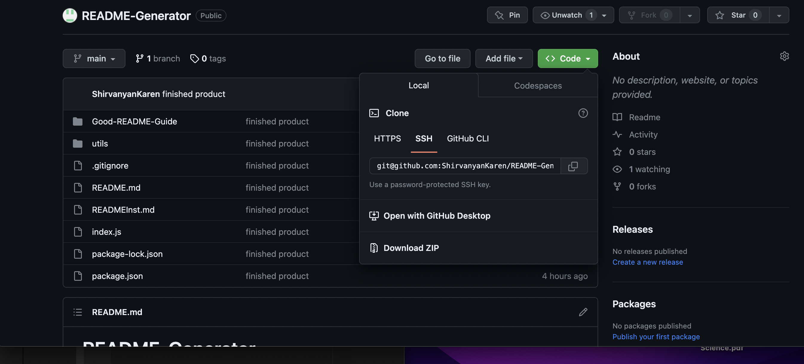
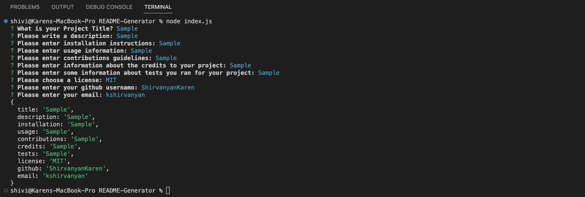
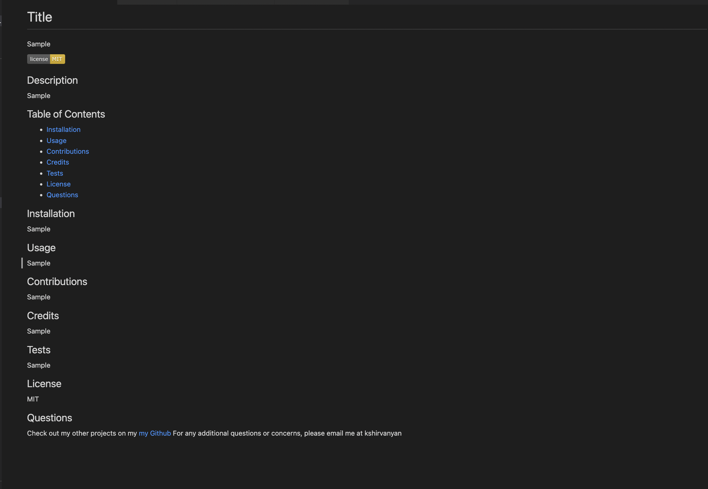

# README-Generator


## Technology used
| Technology Used         | Resource URL           | 
| ------------- |:-------------:| 
| My Repository      | [https://github.com/ShirvanyanKaren/README-Generator](https://github.com/ShirvanyanKaren/README-Generator) |
| Node JS          | [https://nodejs.org/it/docs](https://nodejs.org/it/docs) |
| Git | [https://git-scm.com/](https://git-scm.com/)     | 


# Description

The purpose of this application is to create a README generator that prompts the users for various questions that represent section of the README file. Once The user has answered various questions including the title, choice of badge, installation, contributions, etc. then the desired markdown will be generated with the appropriate format.

The application had to meet the following acceptance criteria:

```md
GIVEN a command-line application that accepts user input
WHEN I am prompted for information about my application repository
THEN a high-quality, professional README.md is generated with the title of my project and sections entitled Description, Table of Contents, Installation, Usage, License, Contributing, Tests, and Questions
WHEN I enter my project title
THEN this is displayed as the title of the README
WHEN I enter a description, installation instructions, usage information, contribution guidelines, and test instructions
THEN this information is added to the sections of the README entitled Description, Installation, Usage, Contributing, and Tests
WHEN I choose a license for my application from a list of options
THEN a badge for that license is added near the top of the README and a notice is added to the section of the README entitled License that explains which license the application is covered under
WHEN I enter my GitHub username
THEN this is added to the section of the README entitled Questions, with a link to my GitHub profile
WHEN I enter my email address
THEN this is added to the section of the README entitled Questions, with instructions on how to reach me with additional questions
WHEN I click on the links in the Table of Contents
THEN I am taken to the corresponding section of the README
```

Here is an example of how the application runs:


## Table of Contents
* [Node JS](#node-js)
* [Installation](#installation)
* [Usage](#usage)
* [Contributions](#contributions)
* [License](#license)
* [Questions](#questions) 


## Node JS

This application was developed using node js. It was an on-the-job ticket that provided starter code to help develop the terminal-based generator. The first step was to initialize the package.json, the node modules, and import these into the index.js files. 
```js
const fs = require("fs");
const inquirer = require("inquirer");
```

The devlopment of the application followed this order:
* Create a constant reference of questions as objects with various properties like name, type, choices, etc.
* Name the responses to these questions and create a template fo how the answers would be integrated into a read me file.
* Create a function to initialize the prompt questions, then pass these answers into the write file function to develop the README

```js
function init() {
    inquirer.prompt (
        questions
    )
    .then ((response) => {
        console.log(response);
        writeToFile("read.me", response)
       
    })
}


```

After these questions are answered, they are then passed over to the write file function, defined as consts, and plugged into this template:

```js
    const README = 
    `# Title
${title}


## Description

${description}

## Table of Contents

* [Installation](#installation)
* [Usage](#usage)
* [Contributions](#contributions)
* [Credits](#credits)
* [Tests](#test)
* [License](#license)
* [Questions](#questions) 

## Installation

${installation}

...
```
Finally, within this function there is an fs.writeFile method that generates the actual file given the information.


## Installation

Simple to install. Simply clone these files from the repository



Then open the index.js in the integrated terminal and enter your responses.



Finally, the application will devlop a README file with your inputs



## Usage 
        
This application can be utilize to create a quick README markdown file that thoroughly includes all the typical sections of a markdown. The user can expand upon these sections with their own information and even add a license badge.
        
## Credits

Jehyun Jung from the Central Tutoring Center helped me with integrating the license badges.
        
## License 
     
MIT licensing with permisions such as commercial use, modification, distribution and private use. Limitations include liability and warranty.

## Questions 

* Check out my other projects on my [my Github](https://github.com/ShirvanyanKaren)
* For any additional questions or concerns, please email me at kshirvanyan2000@gmail.com